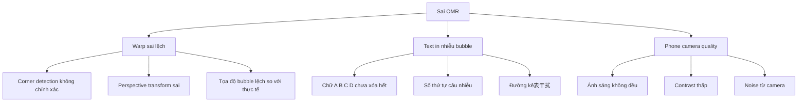
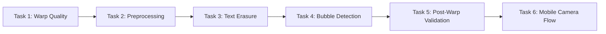

# Kế hoạch cải thiện OMR Accuracy — GradeFlow

## Phân tích vấn đề từ screenshot

### Quan sát từ ảnh kết quả

**Phần I (40 câu ABCD):**
- C1-C20: Phát hiện tương đối ổn (A, A, B, X, X, C, B, A, A, B, C, B, C, D, A, A, B, C, A, A)
- C21-C40: Hầu hết bị nhận sai thành **X** (tô nhiều) hoặc đáp án sai
- Vấn đề: **Càng xuống dưới và sang phải → sai càng nhiều**

**Phần II (8 câu Đúng/Sai):**
- Câu 1-4: Tương đối ổn
- Câu 5-8: Nhiều bubble bị nhận thành **X** (tô nhiều)

**Phần III (6 câu điền số):**
- C1: -8, C2: -8899 → Có vẻ nhận sai số

### Nguyên nhân gốc (Root Causes)

---

## Kế hoạch sửa lỗi — 6 Task

### Task 1: Cải thiện Corner Detection + Warp Quality

**Vấn đề:** Ảnh phone camera có perspective distortion mạnh. Corner detection hiện tại dùng paper_contour hoặc corner_markers nhưng không đủ robust cho ảnh thực tế.

**Giải pháp:**
1. Trong [`detect_paper_and_warp()`](grading/engine/hi.py) — cải thiện robustness:
   - Thêm preprocessing trước khi detect corners: bilateral filter + CLAHE để tăng contrast
   - Sử dụng **multi-scale corner detection**: thử nhiều ngưỡng khác nhau
   - Thêm validation: 4 góc phải tạo thành hình tứ giác gần A4 (aspect ratio ~0.707)
   - Nếu corner detection fail → fallback sang method khác (paper_contour → corner_markers → HoughCircles)

2. Trong [`_warp_to_rect()`](grading/engine/hi.py) — cải thiện warp:
   - Sau warp, validate bằng cách check: bubble grid có align với template không
   - Nếu không align → thử warp lại với margin khác

3. Thêm **post-warp validation**:
   - Kiểm tra 4 corner markers trên ảnh warped có đúng vị trí không
   - Nếu markers lệch > threshold → warp lại với correction

**File sửa:** [`grading/engine/hi.py`](grading/engine/hi.py) (phần detect_paper_and_warp, _warp_to_rect)

---

### Task 2: Cải thiện Preprocessing cho Phone Camera

**Vấn đề:** Ảnh phone camera có ánh sáng không đều, contrast thấp. Preprocess hiện tại (fast mode) không đủ mạnh.

**Giải pháp:**
1. Trong [`preprocess()`](grading/engine/hi.py:1689) — cải thiện fast mode:
   - Thêm **illumination flattening** mạnh hơn: dùng large Gaussian blur làm background, divide
   - Thêm **adaptive CLAHE** với clipLimit cao hơn cho phone camera
   - Thêm **denoising**: Non-local means denoising (cv2.fastNlMeansDenoising)
   - Cải thiện adaptive threshold: thử block_size lớn hơn (51→71) cho ảnh phone

2. Tự động detect phone camera và dùng preprocessing phù hợp:
   - Nếu `_is_phone_camera()` return True → dùng robust mode mặc định
   - Hoặc thêm mode "phone" với preprocessing mạnh nhất

3. Thêm **multi-pass preprocessing**:
   - Pass 1: Normal preprocessing
   - Pass 2: Nếu confidence thấp → thử preprocessing khác (threshold khác, blur khác)
   - Chọn pass có confidence cao nhất

**File sửa:** [`grading/engine/hi.py`](grading/engine/hi.py) (phần preprocess)

---

### Task 3: Cải thiện Text Erasure (Xóa chữ in)

**Vấn đề:** Chữ in A, B, C, D và số thứ tự câu chưa được xóa hết, gây nhiễu bubble detection.

**Giải pháp:**
1. Trong [`erase_printed_text()`](grading/engine/hi.py) — mở rộng vùng xóa:
   - Mở rộng vùng mask cho Part I header (A B C D) — hiện tại chỉ phủ đến y=680, cần phủ rộng hơn
   - Mở rộng vùng mask cho số thứ tự câu (1-10, 11-20, ...)
   - Thêm mask cho đường kẻ表 (horizontal/vertical lines)

2. Cải thiện punch-hole protection:
   - Hiện tại `BUBBLE_PROTECT_RADIUS = BUBBLE_RADIUS + 8` — có thể quá nhỏ
   - Tăng lên `BUBBLE_RADIUS + 12` để bảo vệ bubble tốt hơn
   - Nhưng cần đảm bảo không bảo vệ quá rộng → bỏ lỡ text gần bubble

3. Thêm **morphological cleaning** sau khi erase:
   - Dùng morphological closing để lấp lỗ nhỏ trong bubble
   - Dùng morphological opening để loại nét mảnh còn sót

**File sửa:** [`grading/engine/hi.py`](grading/engine/hi.py) (phần erase_printed_text, _build_text_erase_regions)

---

### Task 4: Cải thiện Bubble Detection Logic

**Vấn đề:** Logic detect bubble hiện tại quá nhạy → detect sai bubble rỗng thành bubble tô.

**Giải pháp:**
1. Trong [`is_bubble_filled()`](grading/engine/hi.py:1932) — tăng ngưỡng:
   - Tăng `FILL_THRESHOLD` từ 0.15 lên 0.18-0.20 (cho ảnh phone camera)
   - Tăng `adaptive_threshold` range: hiện tại 0.8-1.2 → 0.85-1.15
   - Tăng `inner_radius` shrink: hiện tại `radius - 2` → `radius - 3` để tránh edge noise

2. Trong [`_detect_filled_choices()`](grading/engine/hi.py:2246) — cải thiện cluster analysis:
   - Tăng `min_gap_threshold`: hiện tại `max(0.05, 2.0 * noise_floor)` → `max(0.08, 2.5 * noise_floor)`
   - Tăng `min_separation`: hiện tại `max(0.03, 1.5 * noise_floor)` → `max(0.05, 2.0 * noise_floor)`
   - Thêm validation: nếu tất cả 4 bubble có ratio gần nhau (< 0.05 spread) → coi là tất cả rỗng

3. Trong [`_hybrid_score()`](grading/engine/hi.py:2123) — cải thiện CNN hybrid:
   - Hiện tại `HYBRID_ALWAYS_CNN = False` → CNN chỉ chạy trên ambiguous bubbles
   - Thử bật `HYBRID_ALWAYS_CNN = True` để CNN chạy trên TẤT CẢ bubbles
   - Hoặc mở rộng range: `HYBRID_RATIO_LOW = 0.08, HYBRID_RATIO_HIGH = 0.55`

**File sửa:** [`grading/engine/hi.py`](grading/engine/hi.py) (phần is_bubble_filled, _detect_filled_choices, _hybrid_score)

---

### Task 5: Cải thiện Post-Warp Validation

**Vấn đề:** Sau khi warp, không có validation để kiểm tra bubble grid có align đúng không.

**Giải pháp:**
1. Thêm **grid alignment check** sau warp:
   - Trên ảnh warped, detect 4 corner markers (ô đen góc)
   - So sánh vị trí thực tế với vị trí kỳ vọng trong template
   - Tính offset: nếu offset > 5px → warp lại với correction

2. Thêm **bubble presence validation**:
   - Với mỗi bubble center trong template, check xem có circle (HoughCircles) gần đó không
   - Nếu > 30% bubbles không có circle gần → warp sai → retry

3. Thêm **automatic template matching**:
   - Thử nhiều template (28-02-00, 40-08-06, etc.)
   - Chọn template có confidence cao nhất
   - Hiện tại chỉ dùng template mặc định hoặc template do user chọn

**File sửa:** [`grading/engine/hi.py`](grading/engine/hi.py) (phần detect_paper_and_warp, process_sheet)

---

### Task 6: Cải thiện Mobile App Camera Flow

**Vấn đề:** Ảnh chụp từ mobile app có chất lượng thấp hơn so với scan.

**Giải pháp:**
1. Trong API [`grade_frame_api()`](grading/views.py) — cải thiện image quality:
   - Thêm image enhancement trước khi chấm: auto-brightness, contrast
   - Thêm denoising cho ảnh camera
   - Validate ảnh: nếu quá mờ (Laplacian variance < threshold) → yêu cầu chụp lại

2. Trong mobile app (Flutter) — cải thiện camera flow:
   - Hiển thị hướng dẫn chụp: đặt phiếu trên nền sáng, giữ thẳng
   - Auto-capture khi phát hiện phiếu rõ ràng
   - Preview ảnh trước khi submit

3. Thêm **image quality scoring**:
   - Tính quality score trước khi chấm
   - Nếu score quá thấp → hiển thị cảnh báo "Ảnh mờ, vui lòng chụp lại"

**File sửa:** [`grading/views.py`](grading/views.py), [`api/views.py`](api/views.py)

---

## Thứ tự thực hiện

**Ưu tiên cao nhất:** Task 1 + Task 2 + Task 4 (ảnh hưởng lớn nhất đến accuracy)

---

## Metric đánh giá

- **Part I accuracy:** > 95% câu detect đúng (hiện tại ~50-60%)
- **Part II accuracy:** > 90% câu detect đúng (hiện tại ~60-70%)
- **Part III accuracy:** > 85% câu detect đúng (hiện tại ~50%)
- **False positive rate:** < 5% (bubble rỗng bị detect thành tô)
- **False negative rate:** < 5% (bubble tô bị detect thành rỗng)
